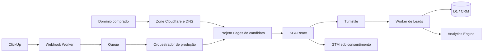

# Arquitetura Cloudflare para a campanha

## Estado confirmado

- A conta Cloudflare já contém os 30 projetos Pages `deputado-01` a
  `deputado-30`, além do `site-athar`.
- Cada candidato está disponível na branch temporária `placeholder`, por
  exemplo `https://placeholder.deputado-01.pages.dev`.
- As aplicações são Vite + React e incluem a Pages Function
  `POST /api/subscribe`.
- O `twlgames.com` é uma boa referência de operação: página pública rápida,
  aquisição, tracking, automação e acompanhamento. Os sites de candidatos
  precisam da mesma disciplina, com isolamento de dados por campanha.

## Camadas e responsabilidade

| Camada | Recurso Cloudflare | Escopo recomendado | Função |
| --- | --- | --- | --- |
| Domínio | Zone + DNS | Um zone por domínio comprado | Autoridade DNS, SSL, redirecionamentos e proteção de borda. |
| Site público | Cloudflare Pages | Um projeto Pages por candidato | Hospeda a SPA e a Pages Function do candidato. |
| Leads | Worker central + D1 | Compartilhado, com `candidate_id` obrigatório | Valida, registra consentimento e encaminha cada cadastro. |
| Mídia | R2 | Bucket privado compartilhado ou por candidato | Originais, vídeos e arquivos grandes; não usar o repositório como arquivo mestre. |
| Automação | Worker do ClickUp + Queues | Compartilhado | Recebe webhooks, valida assinatura e enfileira tarefas confiáveis. |
| Antibot | Turnstile + WAF/rate limiting | Widget por domínio e regra por zone | Protege newsletter, formulários e APIs públicas. |
| Métricas | Web Analytics + GTM | Propriedade/configuração por candidato | Métricas técnicas e eventos de campanha, sob consentimento. |
| Observabilidade | Analytics Engine + logs | Compartilhado, com dimensão `candidate_id` | Eventos de backend, falhas e funil sem misturar campanhas. |

## Recursos que devem ser ativados

### Obrigatórios antes de captação real

1. **DNS e SSL** — adicionar o domínio do candidato como zone Cloudflare;
   apontar nameservers no registrador; anexar domínio ao projeto Pages; ativar
   redirecionamento HTTPS e revisar os registros de e-mail para não quebrar
   SPF/DKIM/DMARC existentes.
2. **Worker de leads** — a atual Pages Function é apenas fallback e não deve
   guardar dados em um KV compartilhado sem modelagem. Criar uma API central
   com `candidate_id`, timestamp, origem, versão do consentimento, deduplicação
   e trilha de auditoria em D1. Conectar ao CRM/e-mail somente após aprovação.
3. **Turnstile** — proteger submissões de formulário no navegador e validar o
   token no Worker. O widget deve ficar associado ao domínio de produção, não
   apenas ao `pages.dev`.
4. **WAF e rate limiting** — ativar regras gerenciadas; limitar
   `POST /api/subscribe` e o endpoint de webhook; bloquear métodos não usados;
   acompanhar eventos de segurança.
5. **Política de privacidade e consentimento LGPD** — publicar os textos do
   candidato/controlador, finalidade, canal de contato e mecanismo de revogação
   antes de coletar dados. GTM/pixels só podem disparar de acordo com a escolha
   registrada do visitante.

### Recomendados na primeira semana

1. **Cloudflare Web Analytics** para disponibilidade, navegação e Web Vitals
   com coleta voltada à privacidade.
2. **Google Tag Manager** por candidato, com um container ID específico salvo
   no `site.toml` e injeção controlada pelo build. Não reutilizar o mesmo
   container para dados de candidatos diferentes.
3. **Analytics Engine** no Worker de leads para eventos agregados como
   `lead_accepted`, `turnstile_failed` e `rate_limited`, sempre com
   `candidate_id` e sem e-mail/nome em telemetria.
4. **R2** para fotos, vídeos de Remotion e anexos de mídia. A publicação deve
   usar URLs controladas ou assets copiados no build; originais ficam privados.
5. **Queues** entre o webhook ClickUp e os processos de geração/deploy. O
   Worker atual apenas registra eventos e não pode executar scripts locais;
   Queue evita reprocessamento e permite um consumidor confiável.
6. **Secrets Store / Workers Secrets** para chaves ClickUp, GTM server-side,
   CRM e validação Turnstile. Nunca colocar tokens em `site.toml`, Git ou
   variáveis visíveis ao navegador.

## Itens que não devem ser compartilhados entre candidatos

- Domínio e zone DNS.
- Container GTM, pixels de anúncio e respectivas conversões.
- Turnstile site key/secret de produção.
- Lista de contatos, CRM, campanhas de e-mail e opt-ins.
- Acesso editorial ao projeto Pages e às propriedades de analytics quando cada
  campanha tiver equipes distintas.

O Worker, D1, R2, Queues e observabilidade podem ser compartilhados somente se
todo registro tiver `candidate_id`, controle de acesso por campanha e retenção
definida.

## Fluxo de domínio por candidato

## Checklist de lançamento por candidato

### Antes do domínio

- [ ] `site.toml` vinculado à tarefa ClickUp correta.
- [ ] Nome, número, partido, proposta, foto, logo e contatos aprovados.
- [ ] Letras/jingles/intros aprovados e anexados às tarefas correspondentes.
- [ ] Build publicado em `placeholder.<projeto>.pages.dev` e revisado.

### Quando o domínio for comprado

- [ ] Registrar domínio no ClickUp e identificar responsável pelo registrador.
- [ ] Criar/adicionar zone ao Cloudflare e trocar nameservers.
- [ ] Conferir DNS de e-mail antes de qualquer alteração de MX, SPF, DKIM ou
  DMARC.
- [ ] Anexar domínio ao projeto Pages do candidato e validar HTTPS.
- [ ] Configurar redirecionamento canônico (`www` ou raiz) e URLs antigas.
- [ ] Criar Turnstile e armazenar secret exclusivamente no Worker.
- [ ] Configurar GTM e a política de consentimento.
- [ ] Ativar WAF/rate limiting e revisar as regras no modo de teste.
- [ ] Provisionar Worker/D1/CRM de leads, testar opt-in e descadastro.
- [ ] Remover `noindex` apenas do domínio final, mantendo previews fora de
  mecanismos de busca.
- [ ] Atualizar URL/status de deploy no ClickUp.

## Ajustes necessários no repositório

1. Criar um manifesto versionado de configuração não secreta por candidato:
   domínio, URL canônica, ID GTM, ID Web Analytics, política de retenção e IDs
   de recursos Cloudflare. Segredos permanecem fora do Git.
2. Adicionar headers de segurança e `X-Robots-Tag: noindex` para os aliases
   `*.pages.dev`; para Functions, retornar headers diretamente do código.
3. Evoluir `/api/subscribe` para um Worker de leads com validação Turnstile,
   consentimento e D1. Só então ativar formulários nos domínios finais.
4. Transformar o webhook ClickUp em produtor de Queue autenticado. A geração de
   jingles, vídeos e deploys precisa ser consumida por um executor próprio; não
   deve rodar diretamente dentro do Worker.

## Decisões que dependem da operação

- Qual registrador e quais domínios pertencem a cada candidato.
- Se cada campanha terá CRM/e-mail separado ou um CRM multi-tenant.
- Política jurídica de retenção, consentimento e exportação de dados.
- IDs de GTM, pixels autorizados e eventos de conversão permitidos.
- Equipe que terá acesso a cada zone, Pages project e dashboard.